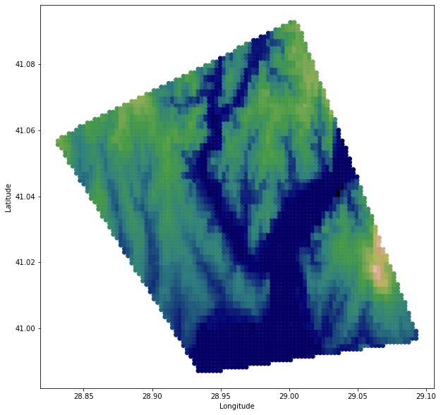

# PolygonElevations

A Python script to generate a mesh grid in a Polygon and get Elevations from api.open-elevation.com. 

The purpose of this script is to generate a mesh grid within a Polygon. The coordinates of the mesh grid is then used to get elevation data from a public API: api.open-elevation.com. The current script can be easly adjust for other APIs. The output of the script are (1) the coordinates within the polygon and (2) elevations of the coordinates. Data can be used for various purposes.

# Requirements

The required Python packages: Pandas, Numpy, Matplotlib, and Shapely.

```
pip install pandas numpy matplotlib shapely
```

# Examples

A Polygon from Istanbul:



See here for more examples.
